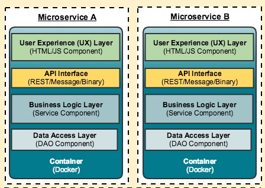

# AspnetMicroservices

### Environment Setup
#### Install Docker
* [Docker Desktop](https://www.docker.com/products/docker-desktop)

#### Install Visual Studio
* [Visual Studio](https://visualstudio.microsoft.com/downloads/)

#### **Useful things to know in the solution settings when working with Docker containers**
-  In the source code of the solution there is a file called appsettings.json. This file is responsible for env variables that will be used in the program. For instance the DatabaseConnection. This is the connection string to the MongoDB datanase. This is set to localhost by default. However, when running the solution in a Docker container, the localhost will not work. Instead, we must use the service name of the mongo db. We do this by injecting the env variable in the docker-compose file. This is done by using the following syntax: `environmnent: - DatabaseSettings:ConnectionString=mongodb://catalogdb:27017`. This will set the env variable to the connection string of the mongo db.
- While trying to debug the program when working with containers. Especially when launching the program from Visual Studio. It is important to know that the program will use the default ConnectionString that's set in the appsettings.json file. This is because the env variable is not set when launching the program from Visual Studio. To get around this, we use the appsettings.Development.json file and define the `DatabaseSettings:ConnectionString` pointing to the container service connection in that file. This file is used when launching the program from Visual Studio in the Development environment.

## Breakdown of all the RESTful APIs

##### All APIs follow the CRUD operations:
- Create
- Read
- Update
- Delete

#### Service ports and endpoints
| Service | Port | Endpoint |
|:--------|:-------------|:----------|
|Catalog API|8000|[ [Local Link](http://localhost:5000/swagger) ] [ [Docker Link](http://localhost:8000/swagger) ]|
|Basket API|8001|[ [Local Link](http://localhost:5001/swagger) ] [ [Docker Link](http://localhost:8001/swagger) ]|
|Portainer|8080, 9000|[ [Docker Link](http://localhost:9000/) ]|
|Discount API|8002|[ [Local Link](http://localhost:5002/swagger) ] [ [Docker Link](http://localhost:8002/swagger) ]|
|Discount gRPC Service|8003|[ [Local Link](http://localhost:5003/swagger) ] [ [Docker Link](http://localhost:8003/swagger) ]|
|pgAdmin|8081|[ [Docker Link](http://localhost:8081/) ]|

### Catalog API (Products)

| Method | Request URI | Use case |
|:--------|:-------------|:----------|
|GET|api/v1/Catalog|Listing Products and Categories|
|GET|api/v1/Catalog/{id}|Get Products with product Id|
|GET|api/v1/Catalog/GetProductByCategory/{category}|Get products by category|
|POST|api/v1/Catalog|Create new product|
|PUT|api/v1/Catalog|Update product|
|DELETE|api/v1/Catalog|Delete product|

#### Catalog API Nuget Packages
| Package | Version | Use case |
|:--------|:-------------|:----------|
|Swashbuckle.AspNetCore|6.5.0|Swagger UI|
|MondoDB.Driver|2.21.0|MongoDB Driver|

#### The APIs are structured in a 3 layer architecture:
- Data Access Layer
- Business Logic Layer
- Presentation Layer

#### **Data Access Layer**
Only database operations are performed in this layer. This layer is responsible for the CRUD operations. This layer is also responsible for the connection to the database. This layer is defined in the `Data/` folder and is called `CatalogContext.cs`. This layer is injected into the Business Logic Layer.

#### **Business Logic Layer**
This layer is responsible for the business logic of the application. For instance, if we want to add a new product, we would do so in this layer. Using this layer. This layer is defined in the `Repositories/` folder and is called `ProductRepository.cs`, another file that exists there is the interface file and is usually called `IProductRepository.cs`. This layer is injected into the Presentation Layer.



#### **Here is a breakdown of the folder structure of the Catalog API**

*Data/* - Contains the MongoDB Context (connection string, database name, collection name)

*Entities/* - Contains the Product entities (description of the product)

*Repositories/* - Contains the Product repository (CRUD operations) this is where the context is injected. This provides an abstraction layer between the controller and the database. 

The benefit of this is that if we ever want to change the logic of how we interact with the database, we can do so without changing the controller and simply change the repository accordingly. When using this we simply use functions such as `GetAllProducts()` or `GetProductById(x)`. This is also particularly useful for unit testing as we can mock the repository and test the controller.

*Controller/* - Contains the Product controller (RESTful API endpoints)

### Basket API (Shopping Cart)
| Method | Request URI | Use case |
|:--------|:-------------|:----------|
|GET|api/v1/Basket|Get basket and items with username|
|POST|api/v1/Basket|Update Basket and Items (add-remove item on basket)|
|DELETE|api/v1/Basket|Delete basket|
|POST|api/v1/Basket/Checkout|Checkout basket|

#### Basket API Nuget Packages
| Package | Version | Use case |
|:--------|:-------------|:----------|
|Swashbuckle.AspNetCore|6.5.0|Swagger UI|
|Microsoft.Extensions.Caching.Distributed.IDistributedCache|7.0.10|Redis Cache|
|Newtonsoft.Json|13.0.3|JSON Serializer|

#### **Here is a breakdown of the folder structure of the Basket API**

*Entities/* - Contains the Basket entities (description of the basket)

*Repositories/* - Contains the Basket repository (CRUD operations) this is where the context is injected. This provides an abstraction layer between the controller and the database.

*Controller/* - Contains the Basket controller (RESTful API endpoints)

### Discount API (Discounts)

#### The Discount Coupons will be held in a postgreSQL database

##### **Schemastics of the database (queries to create the tables)**
```sql

CREATE TABLE Coupon(
    Id SERIAL PRIMARY KEY NOT NULL,
    ProductName VARCHAR(24) NOT NULL,
    Description TEXT,
    Amount INT
);

INSERT INTO Coupon(ProductName, Description, Amount) VALUES('IPhone X', 'IPhone Discount', 150);

INSERT INTO Coupon(ProductName, Description, Amount) VALUES('Samsung 10', 'Samsung Discount', 100);

```

#### Discount API Nuget Packages
| Package | Version | Use case |
|:--------|:-------------|:----------|
|Swashbuckle.AspNetCore|6.5.0|Swagger UI|
|Npgsql|7.0.4|PostgreSQL Driver|
|Dapper|2.0.151|Micro ORM|

The Discount API is a little bit different to the other APIs because we are using Dapper to communicate with the 
database. This makes it a lot easier to communicate with the database, this is due to the fact that we don't have to
create a database context. Instead we invoke a connection using Npgsql and then we can use Dapper to query the database.

#### **Here is a breakdown of the folder structure of the Discount API**

*Entities/* - Contains the Discount entities (description of the discount)

*Repositories/* - Contains the Discount repository (CRUD operations) this is where the context is injected. This provides an abstraction layer between the controller and the database.

*Controller/* - Contains the Discount controller (RESTful API endpoints)

There is also a middleware imbedded in the Program class. This middleware is responsible for creating the database tables if they don't exist. If they do exist, they get dropped and recreated. The program then seeds the database with data. 

##### **To add the middleware, we use the following code in the Program.cs file:**
```csharp

// Configure the HTTP request pipeline.
if (app.Environment.IsDevelopment())
{
    app.MigrateDatabase<Program>(); // <--- This is where middleware is added to the pipeline
    app.UseSwagger();
    app.UseSwaggerUI();
}

```
That function calls the HostExtension Class which is defined in the Extensions folder. This class is responsible for creating the database tables and seeding the database with data - `MigrateDatabase<Program>()`

```csharp
public static IApplicationBuilder MigrateDatabase<TContext>(this IApplicationBuilder host, int? retry = 0)
{
}
```

In the line above we are invoking that function and passing in the Program class as a generic type. This is because we want to use the Program class to get the database connection string. We do this by using the following code:

```csharp
using (var scope = host.ApplicationServices.CreateScope())
{
}
```

In the line above we are creating a scope for the application services. This is because we want to get the service provider. We do this by using the following code:

```csharp
var services = scope.ServiceProvider;
var configuration = services.GetRequiredService<IConfiguration>();
var logger = services.GetRequiredService<ILogger<TContext>>();
```

In the line above we are getting the configuration and the logger from the service provider.

In the line below is an example of how we utilise the configuration to get the connection string. We do this by using the following code:

```csharp
logger.LogInformation("Migrating postgresql database");
string connectionString = configuration.GetValue<string>("DatabaseSettings:ConnectionString");

 using var connection = new NpgsqlConnection
                        (connectionString);
connection.Open();
```
In the last line above we are opening a connection to the database using the connection string. We then use that connection to create the database tables and seed the database with data. We do this by using the following code:

```csharp
using var command = new NpgsqlCommand
{
    Connection = connection,
};

command.CommandText = @"DROP TABLE IF EXISTS Coupon";

command.ExecuteNonQuery();
```

The using var command is used to create a command to execute on the database. We then use the command to execute the query. In the line above we are dropping the table if it exists. We then execute the query by using the following code:

What is using? - The using statement is a C# nicity for dealing with disposable objects. It allows you to ensure that a given object instance is disposed of correctly, regardless of what happens within the code block. This is done by wrapping the object instantiation in a using statement, and then the object is guaranteed to be disposed of when the code execution leaves the using block.

```csharp
command.CommandText = @"CREATE TABLE Coupon(Id SERIAL PRIMARY KEY,
                                            ProductName VARCHAR(24) NOT NULL,
                                            Description TEXT,
                                            Amount INT)";

command.ExecuteNonQuery();

command.CommandText = @"INSERT INTO Coupon(ProductName, Description, Amount) VALUES('IPhone X', 'IPhone Discount', 150)";

command.ExecuteNonQuery();
```

The @ symbol is used to create a string literal. This is because we want to create a string that spans multiple lines. We then execute the query.

### Discount.gRPC Service (Google Remote Procedure Call)

#### The Discount Coupons will be held in a postgreSQL database

### Discount.Grpc Nuget Packages

| Package | Version | Use case |
|:--------|:-------------|:----------|
|Npgsql|7.0.4|PostgreSQL Driver|
|Dapper|2.0.151|Micro ORM|
|Grpc.AspNetCore|2.57.0|gRPC Service|
|AutoMapper.Extensions.Microsoft.DependencyInjection|12.0.1|AutoMapper|

#### **Here is a breakdown of the folder structure of the Discount.gRPC Service**

*Entities/* - Contains the Discount entities (description of the discount)

*Repositories/* - Contains the Discount repository (CRUD operations) this is where the context is injected. This provides an abstraction layer between the controller and the database.

*Services/* - Contains the Discount service (gRPC Service)

*Extensions/* - Contains the Discount service extension (gRPC Service)

*Protos/* - Contains the Discount service proto file (gRPC Service)

*Mapper/* - Contains the Discount service mapper (gRPC Service)

Grpc is interesting because it uses a proto file to define the service. This is a file that defines the service and the messages that are sent and received. This is a file that is used to generate the service and the messages.

You then simply override the service and implement the methods that are defined in the proto file. You then use the service to communicate with the database.